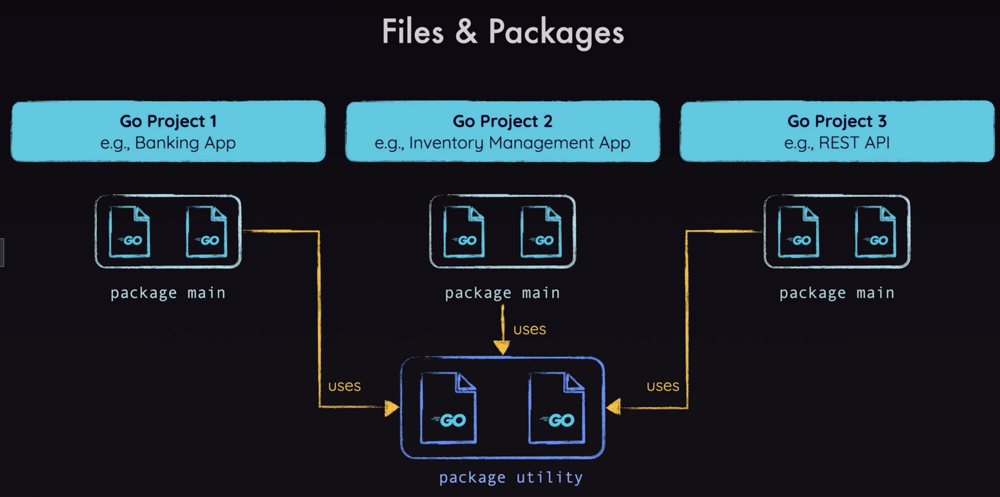

# Go Course

## Go Essentials

### Packages
Siempre deben ir definidos al inicio de cada file. Una app puede tener uno o multiples packages y un package puede estar dividido en multiples files. Ejemplo de package:
```go
package main
```


### Modules
Comando para inicializar un modulo:
```bash
go mod init example.com/first-app  
```

Para crear un ejecutable que no requiere go para correr:
```bash
go build
```
> El modulo debe tener un package llamado main. Para saber en donde debe empezar a ejecutar la app. Si el modulo planea ser una libreria o no ser ejecutado. No requiere este package.

> También debe haber una función dentro del package main que sea nombrada como main.

> Solo debe existir una sola funcion main en todo el modulo.

### Variables

Si **no se va a especificar el tipo de dato** de la variable y **se va a hacer una asignación**, Go ofrece `:=` este shortcut para hacerlo. Ejemplo:
```go
futureValue := investmentAmount * math.Pow(1+expectedReturnRate/100, years)
```